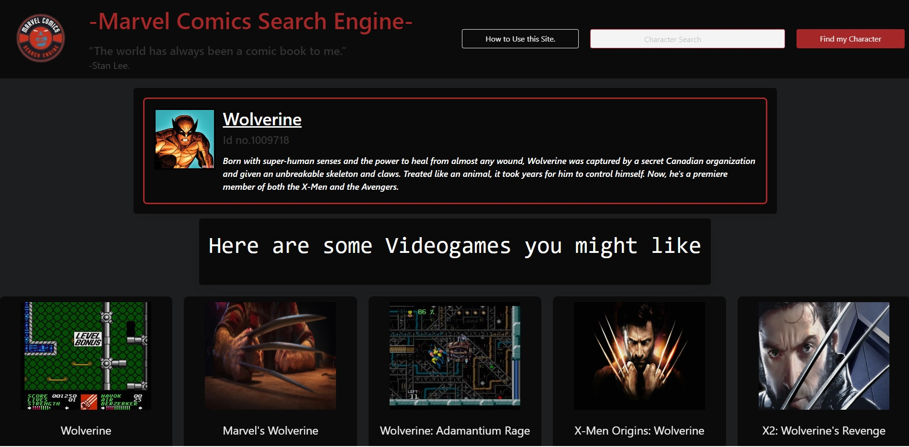

# Marvel-Search-Engine
Search Engine designed to provide information about Marvel Universe as well as videogames related to it's characters.

## Description

- Marvel Comics Search Engine (MCSU) is designed to offer the user easy search for their favorite characters from the Marvel Universe.

- As well as basic info from each character provided by Marvel's api, we have linked a list of games that feature the character.

- The games provided contain information about it's release date and it's overall score so the user can make a more informed choice in case they decide to check out any of the games.

## Technical Skills

## Table of Contents (Optional)

- [Access](#access)
- [Visuals](#visuals)
- [Credits](#credits)
- [License](#license)
- [Features](#features)
- [How to Contribute](#how-to-contribute)

## Access

- The link to the Github repository: https://github.com/EvolanGIT/Marvel-Search-Engine
- Link to the launched website: https://evolangit.github.io/Marvel-Search-Engine/

## Visuals

This is the screenshot of the full-size website featuring a character's infocard and the associated games.
    

    

## Credits (in alphabetical order)

- Benjamin Uloko (buloko8@gmail.com)
- Beto de Armas (ajdearmas13@gmail.com)
- Brandon Grady (nbhsbg53@hotmail.com)
- Gabin Pomphrey (gpomphrey25@gmail.com)
- Yonatan Bermudez (yon_baermund@hotmail.com)

## License

Copyright (c) [2022] [Yonatan Yael Bermudez Diez]

## Features

- Up to 5 games featured from any console.
- Official Character's information from Marvel Comics database.

## How to Contribute

Constructive Comments are always welcome. You can e-mail any person on the credits with any ideas. Thank you for checking out our website.
